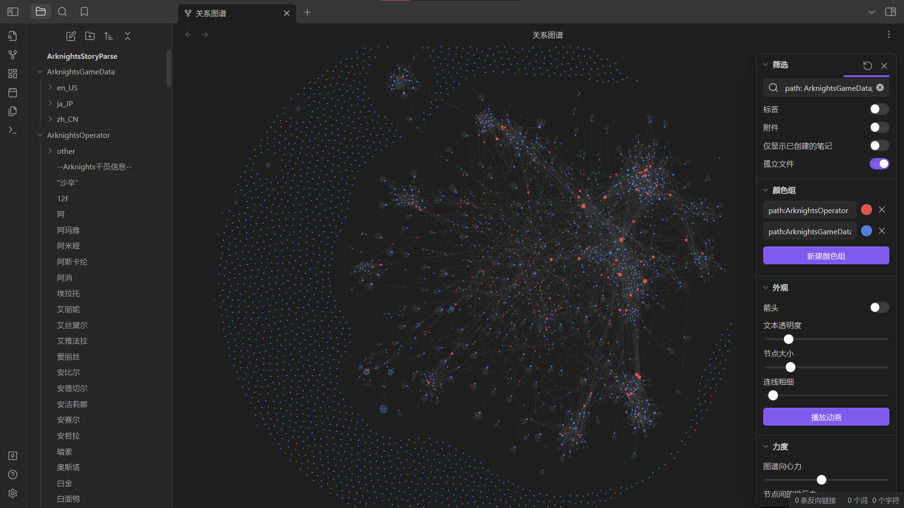
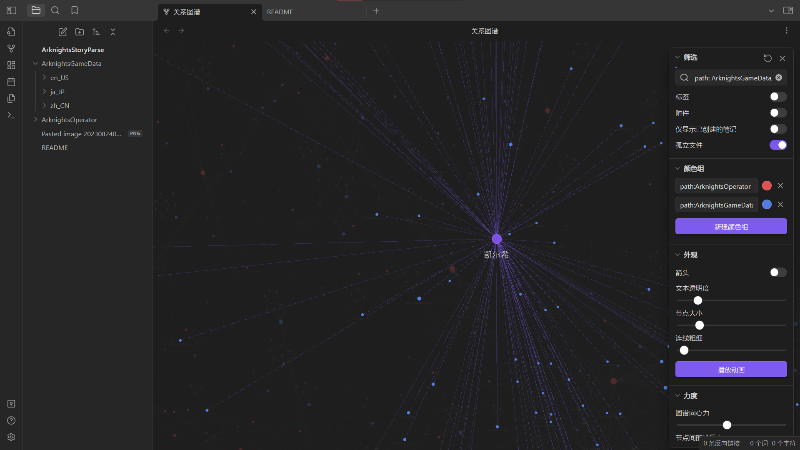
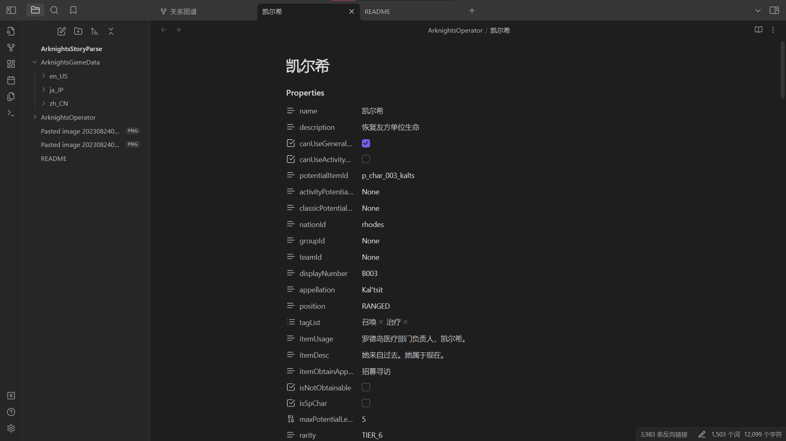
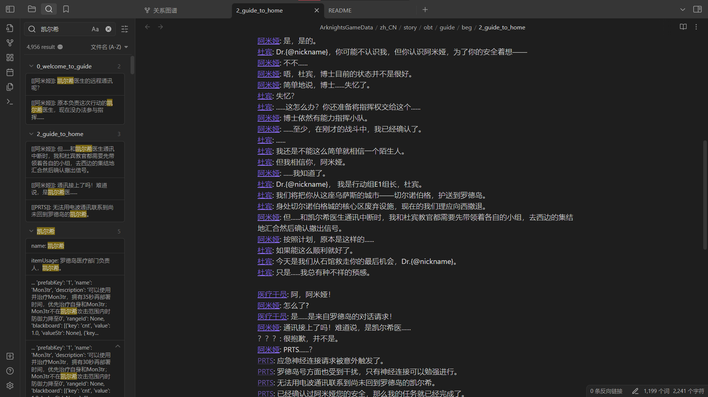

# 明日方舟剧情解析

# 说明

此项目用于从解包数据生成Arknights剧情和人物关联的markdown文件, 构建Obsidian仓库, 使用Obsidian打开此仓库可以展示人物和剧情之间的联系, 以便方舟文学家考古, 此项目首先在无精二群公开, 现分享到GitHub

Fork自[arknightPlotReader](https://github.com/BRSblackshoot/arknightPlotReader), 可以看看作者的README, 解析思路不做过多赘述

数据依赖解包仓库ArknightsGameDate
github链接：[https://github.com/Kengxxiao/ArknightsGameData](https://github.com/Kengxxiao/ArknightsGameData "https://github.com/Kengxxiao/ArknightsGameData")

---

# 使用方法

如果你想在这个基础上进行一些开发,则可以参考以下流程介绍每个功能的实现

## 1.准备数据

从ArknightsGameDate项目获取数据,放到根目录下即可.
这里有两种引入方法(确保你已经安装了git):

1. 直接克隆新的数据, 在此目录运行命令 `git clone https://github.com/Kengxxiao/ArknightsGameData.git`
2. 使用[子模块](##以下是设置子模块的步骤：)引入数据, 参照下面的说明

## 2.处理数据

如果没有需要的数据则运行 `解包剧情阅读器.py`, `character_data_to_md.py` 这两个文件, 分别解析剧情和干员的markdown文件

1. 解包剧情阅读器.py 用于解析剧情
2. character_data_to_md.py 用于解析干员

## 3.数据预览

1. 下载Obsidian, 使用Obsidian打开此文件夹, 并打开关系图谱
2. 在关系图谱筛选条件里添加 `path:(ArknightsGameData/zh_CN OR ArknightsOperator)`, 主要是排除其他文件夹内容

# 更新数据

由Arknights版本更新造成的数据变动, 依赖于ArknightsGameDate的解包项目的更新, 当项目有更新后, 使用git命令拉取更新, 再运行一次处理数据的脚本即可

## 以下是设置子模块的步骤：

1. **在主项目仓库中添加子模块：**
   在主项目的根目录下，使用以下命令添加子模块：
   bashCopy code
   `git submodule add <URL to submodule> <path>`
   其中，`<URL to submodule>` 是子项目的远程仓库 URL，`<path>` 是将子项目放置在主项目中的路径。
2. **初始化和更新子模块：**
   在主项目中添加子模块后，需要进行初始化和更新操作：
   bashCopy code
   `git submodule init git submodule update`
   这将拉取子模块的内容到你的主项目中。
3. **拉取子模块的更新：**
   当子模块的远程仓库有更新时，你可以通过以下命令来拉取子模块的更新：
   bashCopy code
   `git submodule update --remote`
   这会将子模块更新到最新的远程内容。

## Obsidian的其他数据处理技巧

1. 有些干员会有别名, 比如异客-"沙卒", 陈-陈晖洁, 这种情况下如果想要将两个人的md合并, 则需要指定一个主要md, 将别名添加到头文件的yaml字段中(也就是图中的Properties), 字段名为alias, 类型为list, 添加别名后, 图谱中的别名的md会指向此主md, 此时可以删除别名md文件
2. 有些不是干员的剧情人物并不会被character_data_to_md.py脚本创建, 在我想出来解决办法之前需要手动创建, 从关系图谱或者某个剧情或者干员的md文件中点击灰色的超链接直接创建, 此时md内容是空的, 根据需要添加信息, 剧情说明, properties等等
3. 如果有个干员的md文件已经创建, 但是有些对话中出现的, 想要在对话内容中展示的话, 可以运行Note Linker插件处理潜在链接, 这一步耗时极长, 需要耐心等待, 如果我在项目中运行过一次了, 克隆下来的内容就不需要再处理, 仅处理每次更新的新剧情即可

不懂的地方参考Obsidian官方文档及插件文档

---

## 效果展示

